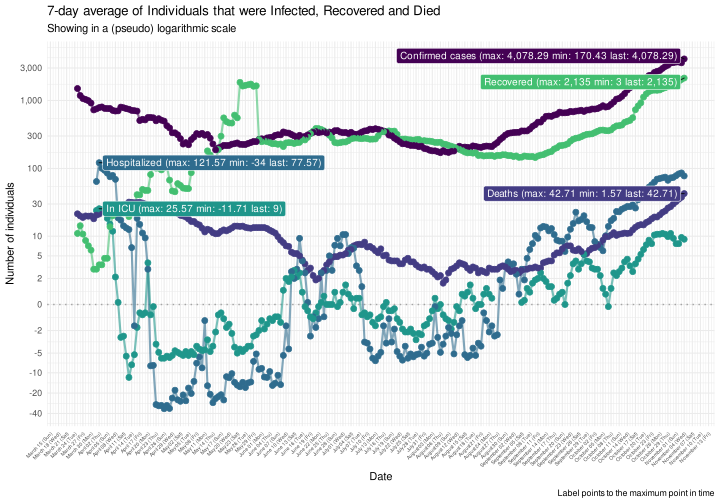

COVID-19 Portugal data
================

> R package with latest data scrapped from official sources *(last data
> from Wednesday, November 04, 2020)*

It downloads the [daily
report](https://covid19.min-saude.pt/relatorio-de-situacao/) from DGS
and stores this in data-friendly format under `/data` directory.

If you are here just for the data, this is what you want:

  - [dgs\_pt.csv](raw/master/data/dgs_pt.csv) *(raw data from Portugal’s
    DGS)*
  - [covid19\_pt.csv](raw/master/data/covid19_pt.csv) *(updated EU CDC
    dataset only featuring Portugal)*

A more detailed analysis of this data is [available
here](https://averissimo.github.io/covid19-analysis/portugal.html)

# Check for new reports

``` r
download.updated.pt()
```

## Data for Portugal

<!-- -->

<!-- -->

<!-- -->

# New cases / deaths by age groups

(removed as it was removed from official data)

# Data

## Data from DGS

Only showing last 10 days

| country  | date       | confirmed | deaths | recovered | tests | hospitalized | in.icu | confirmed\_m\_00-09 | confirmed\_w\_00-09 | confirmed\_m\_10-19 | confirmed\_w\_10-19 | confirmed\_m\_20-29 | confirmed\_w\_20-29 | confirmed\_m\_30-39 | confirmed\_w\_30-39 | confirmed\_m\_40-49 | confirmed\_w\_40-49 | confirmed\_m\_50-59 | confirmed\_w\_50-59 | confirmed\_m\_60-69 | confirmed\_w\_60-69 | confirmed\_m\_70-79 | confirmed\_w\_70-79 | confirmed\_m\_80+ | confirmed\_w\_80+ | death\_m\_00-09 | death\_w\_00-09 | death\_m\_10-19 | death\_w\_10-19 | death\_m\_20-29 | death\_w\_20-29 | death\_m\_30-39 | death\_w\_30-39 | death\_m\_40-49 | death\_w\_40-49 | death\_m\_50-59 | death\_w\_50-59 | death\_m\_60-69 | death\_w\_60-69 | death\_m\_70-79 | death\_w\_70-79 | death\_m\_80+ | death\_w\_80+ |
| :------- | :--------- | --------: | -----: | --------: | ----: | -----------: | -----: | ------------------: | ------------------: | ------------------: | ------------------: | ------------------: | ------------------: | ------------------: | ------------------: | ------------------: | ------------------: | ------------------: | ------------------: | ------------------: | ------------------: | ------------------: | ------------------: | ----------------: | ----------------: | --------------: | --------------: | --------------: | --------------: | --------------: | --------------: | --------------: | --------------: | --------------: | --------------: | --------------: | --------------: | --------------: | --------------: | --------------: | --------------: | ------------: | ------------: |
| Portugal | 2020-11-04 |    156940 |   2694 |     88946 |    NA |         2337 |    325 |                  NA |                  NA |                  NA |                  NA |                  NA |                  NA |                  NA |                  NA |                  NA |                  NA |                  NA |                  NA |                  NA |                  NA |                  NA |                  NA |                NA |                NA |              NA |              NA |              NA |              NA |              NA |              NA |              NA |              NA |              NA |              NA |              NA |              NA |              NA |              NA |              NA |              NA |            NA |            NA |
| Portugal | 2020-11-03 |    149443 |   2635 |     86589 |    NA |         2349 |    320 |                  NA |                  NA |                  NA |                  NA |                  NA |                  NA |                  NA |                  NA |                  NA |                  NA |                  NA |                  NA |                  NA |                  NA |                  NA |                  NA |                NA |                NA |              NA |              NA |              NA |              NA |              NA |              NA |              NA |              NA |              NA |              NA |              NA |              NA |              NA |              NA |              NA |              NA |            NA |            NA |
| Portugal | 2020-11-02 |    146847 |   2590 |     83294 |    NA |         2255 |    294 |                  NA |                  NA |                  NA |                  NA |                  NA |                  NA |                  NA |                  NA |                  NA |                  NA |                  NA |                  NA |                  NA |                  NA |                  NA |                  NA |                NA |                NA |              NA |              NA |              NA |              NA |              NA |              NA |              NA |              NA |              NA |              NA |              NA |              NA |              NA |              NA |              NA |              NA |            NA |            NA |
| Portugal | 2020-11-01 |    144341 |   2544 |     81771 |    NA |         2122 |    284 |                  NA |                  NA |                  NA |                  NA |                  NA |                  NA |                  NA |                  NA |                  NA |                  NA |                  NA |                  NA |                  NA |                  NA |                  NA |                  NA |                NA |                NA |              NA |              NA |              NA |              NA |              NA |              NA |              NA |              NA |              NA |              NA |              NA |              NA |              NA |              NA |              NA |              NA |            NA |            NA |
| Portugal | 2020-10-31 |    141279 |   2507 |     80280 |    NA |         1972 |    286 |                  NA |                  NA |                  NA |                  NA |                  NA |                  NA |                  NA |                  NA |                  NA |                  NA |                  NA |                  NA |                  NA |                  NA |                  NA |                  NA |                NA |                NA |              NA |              NA |              NA |              NA |              NA |              NA |              NA |              NA |              NA |              NA |              NA |              NA |              NA |              NA |              NA |              NA |            NA |            NA |
| Portugal | 2020-10-30 |    137272 |   2468 |     77449 |    NA |         1927 |    275 |                  NA |                  NA |                  NA |                  NA |                  NA |                  NA |                  NA |                  NA |                  NA |                  NA |                  NA |                  NA |                  NA |                  NA |                  NA |                  NA |                NA |                NA |              NA |              NA |              NA |              NA |              NA |              NA |              NA |              NA |              NA |              NA |              NA |              NA |              NA |              NA |              NA |              NA |            NA |            NA |
| Portugal | 2020-10-29 |    132616 |   2428 |     75702 |    NA |         1834 |    269 |                  NA |                  NA |                  NA |                  NA |                  NA |                  NA |                  NA |                  NA |                  NA |                  NA |                  NA |                  NA |                  NA |                  NA |                  NA |                  NA |                NA |                NA |              NA |              NA |              NA |              NA |              NA |              NA |              NA |              NA |              NA |              NA |              NA |              NA |              NA |              NA |              NA |              NA |            NA |            NA |
| Portugal | 2020-10-28 |    128392 |   2395 |     74001 |    NA |         1794 |    262 |                  NA |                  NA |                  NA |                  NA |                  NA |                  NA |                  NA |                  NA |                  NA |                  NA |                  NA |                  NA |                  NA |                  NA |                  NA |                  NA |                NA |                NA |              NA |              NA |              NA |              NA |              NA |              NA |              NA |              NA |              NA |              NA |              NA |              NA |              NA |              NA |              NA |              NA |            NA |            NA |
| Portugal | 2020-10-27 |    124432 |   2371 |     72344 |    NA |         1747 |    253 |                  NA |                  NA |                  NA |                  NA |                  NA |                  NA |                  NA |                  NA |                  NA |                  NA |                  NA |                  NA |                  NA |                  NA |                  NA |                  NA |                NA |                NA |              NA |              NA |              NA |              NA |              NA |              NA |              NA |              NA |              NA |              NA |              NA |              NA |              NA |              NA |              NA |              NA |            NA |            NA |
| Portugal | 2020-10-26 |    121133 |   2343 |     69956 |    NA |         1672 |    240 |                  NA |                  NA |                  NA |                  NA |                  NA |                  NA |                  NA |                  NA |                  NA |                  NA |                  NA |                  NA |                  NA |                  NA |                  NA |                  NA |                NA |                NA |              NA |              NA |              NA |              NA |              NA |              NA |              NA |              NA |              NA |              NA |              NA |              NA |              NA |              NA |              NA |              NA |            NA |            NA |
| Portugal | 2020-10-25 |    118686 |   2316 |     68877 |    NA |         1574 |    230 |                  NA |                  NA |                  NA |                  NA |                  NA |                  NA |                  NA |                  NA |                  NA |                  NA |                  NA |                  NA |                  NA |                  NA |                  NA |                  NA |                NA |                NA |              NA |              NA |              NA |              NA |              NA |              NA |              NA |              NA |              NA |              NA |              NA |              NA |              NA |              NA |              NA |              NA |            NA |            NA |
| Portugal | 2020-10-24 |    116109 |   2297 |     67842 |    NA |         1455 |    221 |                  NA |                  NA |                  NA |                  NA |                  NA |                  NA |                  NA |                  NA |                  NA |                  NA |                  NA |                  NA |                  NA |                  NA |                  NA |                  NA |                NA |                NA |              NA |              NA |              NA |              NA |              NA |              NA |              NA |              NA |              NA |              NA |              NA |              NA |              NA |              NA |              NA |              NA |            NA |            NA |
| Portugal | 2020-10-23 |    112440 |   2276 |     65880 |    NA |         1418 |    198 |                  NA |                  NA |                  NA |                  NA |                  NA |                  NA |                  NA |                  NA |                  NA |                  NA |                  NA |                  NA |                  NA |                  NA |                  NA |                  NA |                NA |                NA |              NA |              NA |              NA |              NA |              NA |              NA |              NA |              NA |              NA |              NA |              NA |              NA |              NA |              NA |              NA |              NA |            NA |            NA |
| Portugal | 2020-10-22 |    109541 |   2245 |     64531 |    NA |         1365 |    200 |                  NA |                  NA |                  NA |                  NA |                  NA |                  NA |                  NA |                  NA |                  NA |                  NA |                  NA |                  NA |                  NA |                  NA |                  NA |                  NA |                NA |                NA |              NA |              NA |              NA |              NA |              NA |              NA |              NA |              NA |              NA |              NA |              NA |              NA |              NA |              NA |              NA |              NA |            NA |            NA |
| Portugal | 2020-10-21 |    106271 |   2229 |     63238 |    NA |         1272 |    187 |                  NA |                  NA |                  NA |                  NA |                  NA |                  NA |                  NA |                  NA |                  NA |                  NA |                  NA |                  NA |                  NA |                  NA |                  NA |                  NA |                NA |                NA |              NA |              NA |              NA |              NA |              NA |              NA |              NA |              NA |              NA |              NA |              NA |              NA |              NA |              NA |              NA |              NA |            NA |            NA |
| Portugal | 2020-10-20 |    103736 |   2213 |     61898 |    NA |         1237 |    176 |                  NA |                  NA |                  NA |                  NA |                  NA |                  NA |                  NA |                  NA |                  NA |                  NA |                  NA |                  NA |                  NA |                  NA |                  NA |                  NA |                NA |                NA |              NA |              NA |              NA |              NA |              NA |              NA |              NA |              NA |              NA |              NA |              NA |              NA |              NA |              NA |              NA |              NA |            NA |            NA |
| Portugal | 2020-10-19 |    101860 |   2198 |     59966 |    NA |         1174 |    165 |                  NA |                  NA |                  NA |                  NA |                  NA |                  NA |                  NA |                  NA |                  NA |                  NA |                  NA |                  NA |                  NA |                  NA |                  NA |                  NA |                NA |                NA |              NA |              NA |              NA |              NA |              NA |              NA |              NA |              NA |              NA |              NA |              NA |              NA |              NA |              NA |              NA |              NA |            NA |            NA |
| Portugal | 2020-10-18 |     99911 |   2181 |     59000 |    NA |         1086 |    155 |                  NA |                  NA |                  NA |                  NA |                  NA |                  NA |                  NA |                  NA |                  NA |                  NA |                  NA |                  NA |                  NA |                  NA |                  NA |                  NA |                NA |                NA |              NA |              NA |              NA |              NA |              NA |              NA |              NA |              NA |              NA |              NA |              NA |              NA |              NA |              NA |              NA |              NA |            NA |            NA |
| Portugal | 2020-10-17 |     98055 |   2162 |     57919 |    NA |         1014 |    148 |                  NA |                  NA |                  NA |                  NA |                  NA |                  NA |                  NA |                  NA |                  NA |                  NA |                  NA |                  NA |                  NA |                  NA |                  NA |                  NA |                NA |                NA |              NA |              NA |              NA |              NA |              NA |              NA |              NA |              NA |              NA |              NA |              NA |              NA |              NA |              NA |              NA |              NA |            NA |            NA |
| Portugal | 2020-10-16 |     95902 |   2149 |     56066 |    NA |         1015 |    144 |                  NA |                  NA |                  NA |                  NA |                  NA |                  NA |                  NA |                  NA |                  NA |                  NA |                  NA |                  NA |                  NA |                  NA |                  NA |                  NA |                NA |                NA |              NA |              NA |              NA |              NA |              NA |              NA |              NA |              NA |              NA |              NA |              NA |              NA |              NA |              NA |              NA |              NA |            NA |            NA |

## Data from EU CDC updated

Only showing last 10 days.

Don’t be alarmed with the first line being in the future, EU CDC date
always refer to the situation on the previous day.

| dateRep    | day | month | year | cases | deaths | countriesAndTerritories | geoId | countryterritoryCode | popData2019 | continentExp | Cumulative\_number\_for\_14\_days\_of\_COVID-19\_cases\_per\_100000 |
| :--------- | --: | ----: | ---: | ----: | -----: | :---------------------- | :---- | :------------------- | ----------: | :----------- | ------------------------------------------------------------------: |
| 05/11/2020 |   5 |    11 | 2020 |  7497 |     59 | Portugal                | PT    | PRT                  |    10276617 | Europe       |                                                                  NA |
| 04/11/2020 |   4 |    11 | 2020 |  2596 |     45 | Portugal                | PT    | PRT                  |    10276617 | Europe       |                                                            444.7670 |
| 03/11/2020 |   3 |    11 | 2020 |  2506 |     46 | Portugal                | PT    | PRT                  |    10276617 | Europe       |                                                            437.7608 |
| 02/11/2020 |   2 |    11 | 2020 |  3062 |     37 | Portugal                | PT    | PRT                  |    10276617 | Europe       |                                                            432.3407 |
| 01/11/2020 |   1 |    11 | 2020 |  4007 |     39 | Portugal                | PT    | PRT                  |    10276617 | Europe       |                                                            420.6053 |
| 31/10/2020 |  31 |    10 | 2020 |  4656 |     40 | Portugal                | PT    | PRT                  |    10276617 | Europe       |                                                            402.5644 |
| 30/10/2020 |  30 |    10 | 2020 |  4224 |     33 | Portugal                | PT    | PRT                  |    10276617 | Europe       |                                                            382.6356 |
| 29/10/2020 |  29 |    10 | 2020 |  3960 |     24 | Portugal                | PT    | PRT                  |    10276617 | Europe       |                                                            361.9771 |
| 28/10/2020 |  28 |    10 | 2020 |  3299 |     28 | Portugal                | PT    | PRT                  |    10276617 | Europe       |                                                            343.6053 |
| 27/10/2020 |  27 |    10 | 2020 |  2447 |     27 | Portugal                | PT    | PRT                  |    10276617 | Europe       |                                                            323.2581 |
