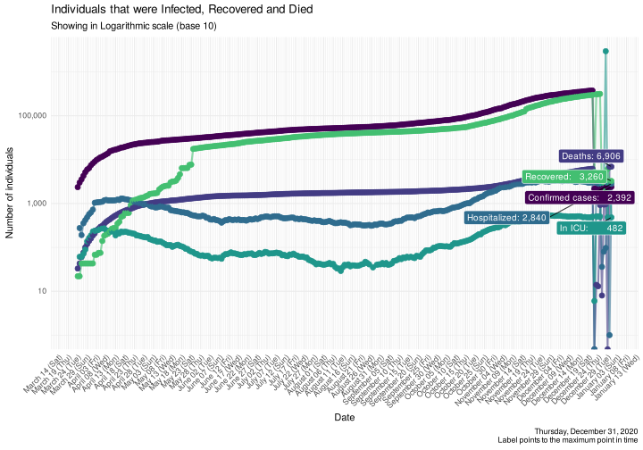
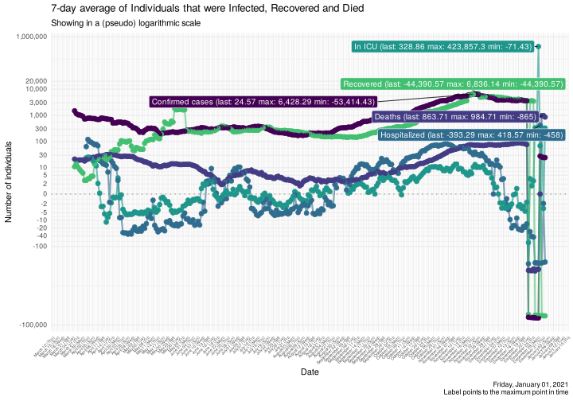
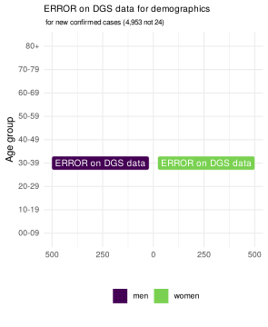
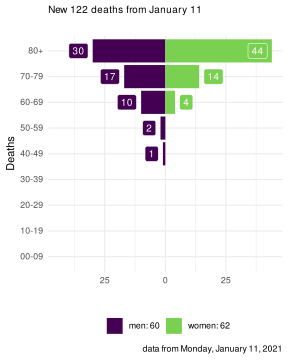
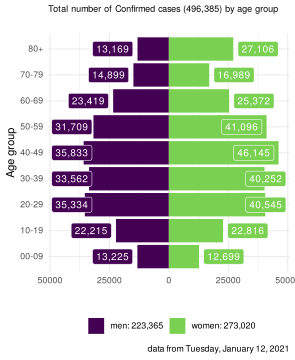
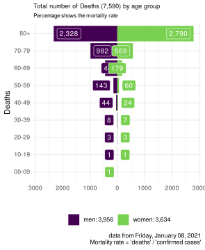

COVID-19 Portugal data
================

> R package with latest data scrapped from official sources *(last data
> from Monday, December 14, 2020)*

It downloads the [daily
report](https://covid19.min-saude.pt/relatorio-de-situacao/) from DGS
and stores this in data-friendly format under `/data` directory.

If you are here just for the data, this is what you want:

  - [dgs\_pt.csv](raw/master/data/dgs_pt.csv) *(raw data from Portugal’s
    DGS)*
  - [covid19\_pt.csv](raw/master/data/covid19_pt.csv) *(updated EU CDC
    dataset only featuring Portugal)*

A mortality analysis of Portugal is [available
here](https://averissimo.github.io/covid19-analysis/mortality.html)

# Check for new reports

``` r
download.updated.pt()
```

## Data for Portugal

<!-- -->

<!-- -->

<!-- -->

# New cases / deaths by age groups

*note: data update may be delayed by a couple of hours (since age data
was been removed from daily report and we’ve been retrieving it from
DGS’s covid19 dashboard, which may have a delay)*

Age data may show different numbers from absolutes in the daily report.
This is out of our control and dependent on the data source *(DGS
covid19 dashboard)*.

<!-- --><!-- -->

# All cases / deaths by age groups

Age data may show different numbers from absolutes in the daily report.
This is out of our control and dependent on the data source *(DGS
covid19 dashboard)*.

<!-- --><!-- -->

# Data

## Data from DGS

Only showing last 10 days

| country  | date       | confirmed | deaths | recovered | tests | hospitalized | in.icu | confirmed\_m\_00-09 | confirmed\_w\_00-09 | confirmed\_m\_10-19 | confirmed\_w\_10-19 | confirmed\_m\_20-29 | confirmed\_w\_20-29 | confirmed\_m\_30-39 | confirmed\_w\_30-39 | confirmed\_m\_40-49 | confirmed\_w\_40-49 | confirmed\_m\_50-59 | confirmed\_w\_50-59 | confirmed\_m\_60-69 | confirmed\_w\_60-69 | confirmed\_m\_70-79 | confirmed\_w\_70-79 | confirmed\_m\_80+ | confirmed\_w\_80+ | death\_m\_00-09 | death\_w\_00-09 | death\_m\_10-19 | death\_w\_10-19 | death\_m\_20-29 | death\_w\_20-29 | death\_m\_30-39 | death\_w\_30-39 | death\_m\_40-49 | death\_w\_40-49 | death\_m\_50-59 | death\_w\_50-59 | death\_m\_60-69 | death\_w\_60-69 | death\_m\_70-79 | death\_w\_70-79 | death\_m\_80+ | death\_w\_80+ |
| :------- | :--------- | --------: | -----: | --------: | ----: | -----------: | -----: | ------------------: | ------------------: | ------------------: | ------------------: | ------------------: | ------------------: | ------------------: | ------------------: | ------------------: | ------------------: | ------------------: | ------------------: | ------------------: | ------------------: | ------------------: | ------------------: | ----------------: | ----------------: | --------------: | --------------: | --------------: | --------------: | --------------: | --------------: | --------------: | --------------: | --------------: | --------------: | --------------: | --------------: | --------------: | --------------: | --------------: | --------------: | ------------: | ------------: |
| Portugal | 2020-12-14 |    350938 |   5649 |    274277 |    NA |         3254 |    513 |                  NA |                  NA |                  NA |                  NA |                  NA |                  NA |                  NA |                  NA |                  NA |                  NA |                  NA |                  NA |                  NA |                  NA |                  NA |                  NA |                NA |                NA |              NA |              NA |              NA |              NA |              NA |              NA |              NA |              NA |              NA |              NA |              NA |              NA |              NA |              NA |              NA |              NA |            NA |            NA |
| Portugal | 2020-12-13 |    348744 |   5559 |    271322 |    NA |         3157 |    513 |                9321 |                8918 |               15511 |               15927 |               25300 |               28923 |               23891 |               28731 |               25261 |               32947 |               22151 |               28918 |               16095 |               17426 |               10234 |               10234 |              8954 |             18573 |               0 |               1 |               0 |               1 |               2 |               3 |               6 |               5 |              30 |              16 |             109 |              41 |             333 |             130 |             707 |             423 |          1727 |          2025 |
| Portugal | 2020-12-12 |    344700 |   5461 |    268453 |    NA |         3093 |    503 |                9217 |                8805 |               15294 |               15703 |               25051 |               28582 |               23626 |               28432 |               24992 |               32601 |               21900 |               28577 |               15927 |               17202 |               10091 |               11363 |              8849 |             18355 |               0 |               1 |               0 |               1 |               2 |               3 |               5 |               4 |              30 |              16 |             109 |              41 |             329 |             130 |             694 |             419 |          1693 |          1984 |
| Portugal | 2020-12-11 |    340287 |   5373 |    263648 |    NA |         3230 |    507 |                9097 |                8685 |               15070 |               15501 |               24722 |               28231 |               23330 |               28074 |               24684 |               32231 |               21619 |               28210 |               15736 |               16980 |                9950 |               11231 |              8747 |             18055 |               0 |               1 |               0 |               0 |               2 |               3 |               5 |               4 |              30 |              16 |             108 |              39 |             325 |             128 |             680 |             412 |          1666 |          1954 |
| Portugal | 2020-12-10 |    335207 |   5278 |    259548 |    NA |         3304 |    509 |                8966 |                8539 |               14828 |               15230 |               24387 |               27854 |               23013 |               27688 |               24339 |               31763 |               21323 |               27778 |               15474 |               16731 |                9795 |               11038 |              8620 |             17708 |               0 |               1 |               0 |               0 |               2 |               3 |               5 |               4 |              30 |              16 |             108 |              39 |             319 |             128 |             668 |             405 |          1643 |          1907 |
| Portugal | 2020-12-09 |    332073 |   5192 |    254700 |    NA |         3332 |    504 |                8732 |                8297 |               14526 |               14930 |               23223 |               27009 |               22195 |               27024 |               23595 |               31059 |               20802 |               27181 |               15091 |               16360 |                9576 |               10766 |              8348 |             17155 |               0 |               1 |               0 |               0 |               2 |               3 |               5 |               4 |              30 |              16 |             107 |              38 |             317 |             126 |             662 |             394 |          1608 |          1879 |
| Portugal | 2020-12-08 |    327976 |   5122 |    252428 |    NA |         3263 |    499 |                8609 |                8176 |               14342 |               14720 |               23000 |               26711 |               21930 |               26702 |               23319 |               30698 |               20532 |               26851 |               14896 |               16160 |                9448 |               10606 |              8224 |             16867 |               0 |               1 |               0 |               0 |               2 |               3 |               5 |               4 |              30 |              16 |             107 |              38 |             311 |             126 |             649 |             393 |          1579 |          1858 |
| Portugal | 2020-12-07 |    325071 |   5041 |    245843 |    NA |         3367 |    513 |                8536 |                8101 |               14240 |               14608 |               22815 |               26491 |               21763 |               26490 |               23127 |               30486 |               20340 |               26600 |               14730 |               16014 |                9354 |               10495 |              8121 |             16608 |               0 |               1 |               0 |               0 |               2 |               3 |               5 |               4 |              30 |              16 |             106 |              38 |             304 |             123 |             639 |             390 |          1554 |          1826 |
| Portugal | 2020-12-06 |    322474 |   4963 |    243055 |    NA |         3268 |    514 |                8459 |                8023 |               14132 |               14494 |               22672 |               26312 |               21611 |               26307 |               22943 |               30233 |               20190 |               26405 |               14608 |               15887 |                9241 |               10394 |              8023 |             16406 |               0 |               1 |               0 |               0 |               2 |               3 |               4 |               4 |              30 |              16 |             105 |              37 |             301 |             120 |             631 |             386 |          1519 |          1804 |
| Portugal | 2020-12-05 |    318640 |   4876 |    240203 |    NA |         3229 |    517 |                8321 |                7886 |               13931 |               14321 |               22486 |               26053 |               21416 |               26023 |               22686 |               29845 |               19966 |               26112 |               14429 |               15711 |                9113 |               10249 |              7885 |             16115 |               0 |               1 |               0 |               0 |               2 |               3 |               4 |               4 |              30 |              15 |             102 |              37 |             297 |             118 |             621 |             382 |          1489 |          1771 |
| Portugal | 2020-12-04 |    312553 |   4803 |    234038 |    NA |         3295 |    526 |                8161 |                7735 |               13632 |               14055 |               22093 |               25601 |               21066 |               25585 |               22346 |               29355 |               19637 |               25728 |               14195 |               15461 |                8956 |               10088 |              7731 |             15851 |               0 |               1 |               0 |               0 |               2 |               3 |               4 |               4 |              30 |              15 |             102 |              37 |             286 |             114 |             607 |             377 |          1471 |          1750 |
| Portugal | 2020-12-03 |    307618 |   4724 |    229018 |    NA |         3330 |    525 |                8022 |                7574 |               13394 |               13784 |               21777 |               25276 |               20754 |               25184 |               21986 |               28846 |               19325 |               25336 |               13891 |               15220 |                8826 |                9907 |              7610 |             15580 |               0 |               1 |               0 |               0 |               2 |               3 |               4 |               4 |              30 |              15 |             101 |              37 |             283 |             113 |             601 |             368 |          1441 |          1721 |
| Portugal | 2020-12-02 |    303846 |   4645 |    223446 |    NA |         3338 |    525 |                7915 |                7475 |               13243 |               13603 |               21554 |               25000 |               20512 |               24920 |               21729 |               28484 |               19100 |               25003 |               13797 |               15029 |                8692 |                9757 |              7500 |             15330 |               0 |               1 |               0 |               0 |               2 |               3 |               4 |               4 |              30 |              15 |              98 |              37 |             277 |             112 |             590 |             362 |          1419 |          1691 |
| Portugal | 2020-12-01 |    300462 |   4577 |    220877 |    NA |         3275 |    521 |                7791 |                7371 |               13084 |               13418 |               21363 |               24727 |               20315 |               24644 |               21468 |               28122 |               18902 |               24719 |               13648 |               14876 |                8599 |                9659 |              7411 |             15164 |               0 |               1 |               0 |               0 |               2 |               3 |               4 |               4 |              28 |              15 |              98 |              37 |             273 |             112 |             574 |             360 |          1400 |          1666 |
| Portugal | 2020-11-30 |    298061 |   4505 |    212942 |    NA |         3342 |    525 |                7734 |                7309 |               12972 |               13286 |               21244 |               24573 |               20186 |               24456 |               21304 |               27900 |               18754 |               24506 |               13527 |               14729 |                8512 |                9569 |              7331 |             15010 |               0 |               1 |               0 |               0 |               2 |               2 |               4 |               3 |              27 |              15 |              97 |              37 |             269 |             111 |             565 |             354 |          1380 |          1638 |
| Portugal | 2020-11-29 |    294799 |   4427 |    209534 |    NA |         3245 |    536 |                7647 |                7180 |               12809 |               13111 |               21046 |               24352 |               20031 |               24209 |               21084 |               27596 |               18566 |               24255 |               13383 |               14549 |                8398 |                9444 |              7229 |             14792 |               0 |               1 |               0 |               0 |               2 |               2 |               3 |               3 |              27 |              15 |              95 |              36 |             261 |             110 |             555 |             345 |          1359 |          1613 |
| Portugal | 2020-11-28 |    290706 |   4363 |    206275 |    NA |         3155 |    529 |                7510 |                7031 |               12576 |               12914 |               20793 |               24037 |               19778 |               23892 |               20839 |               27197 |               18330 |               23905 |               13182 |               14347 |                8271 |                9283 |              7151 |             14579 |               0 |               1 |               0 |               0 |               2 |               2 |               3 |               3 |              26 |              15 |              92 |              36 |             258 |             108 |             549 |             340 |          1338 |          1590 |
| Portugal | 2020-11-27 |    285838 |   4276 |    199446 |    NA |         3208 |    526 |                7341 |                6885 |               12326 |               12670 |               20498 |               23682 |               19486 |               23520 |               20537 |               26733 |               18006 |               23453 |               12949 |               14091 |                8148 |                9126 |              6995 |             14261 |               0 |               1 |               0 |               0 |               2 |               2 |               3 |               3 |              24 |              15 |              90 |              35 |             250 |             106 |             533 |             332 |          1311 |          1569 |
| Portugal | 2020-11-26 |    280394 |   4209 |    193944 |    NA |         3192 |    516 |                6966 |                6518 |               11687 |               12046 |               19695 |               22829 |               18723 |               22619 |               19695 |               25599 |               17285 |               22548 |               12385 |               13464 |                7822 |                8737 |              6731 |             13725 |               0 |               1 |               0 |               0 |               2 |               2 |               3 |               3 |              23 |              14 |              88 |              34 |             244 |             104 |             510 |             315 |          1264 |          1520 |
| Portugal | 2020-11-25 |    274011 |   4127 |    189356 |    NA |         3251 |    517 |                6966 |                6518 |               11687 |               12406 |               19695 |               22829 |               18723 |               22619 |               19695 |               25599 |               17285 |               22548 |               12385 |               13464 |                7822 |                8737 |              6731 |             13725 |               0 |               1 |               0 |               0 |               2 |               2 |               3 |               3 |              23 |              14 |              88 |              34 |             244 |             104 |             510 |             315 |          1264 |          1520 |

## Data from EU CDC updated

Only showing last 10 days.

Don’t be alarmed with the first line being in the future, EU CDC date
always refer to the situation on the previous day.

| dateRep    | day | month | year | cases | deaths | countriesAndTerritories | geoId | countryterritoryCode | popData2019 | continentExp | Cumulative\_number\_for\_14\_days\_of\_COVID-19\_cases\_per\_100000 |
| :--------- | --: | ----: | ---: | ----: | -----: | :---------------------- | :---- | :------------------- | ----------: | :----------- | ------------------------------------------------------------------: |
| 15/12/2020 |  15 |    12 | 2020 |  2194 |     90 | Portugal                | PT    | PRT                  |    10276617 | Europe       |                                                                  NA |
| 14/12/2020 |  14 |    12 | 2020 |  4044 |     98 | Portugal                | PT    | PRT                  |    10276617 | Europe       |                                                            524.9296 |
| 13/12/2020 |  13 |    12 | 2020 |  4413 |     88 | Portugal                | PT    | PRT                  |    10276617 | Europe       |                                                            525.4064 |
| 12/12/2020 |  12 |    12 | 2020 |  5080 |     95 | Portugal                | PT    | PRT                  |    10276617 | Europe       |                                                            529.8339 |
| 11/12/2020 |  11 |    12 | 2020 |  3134 |     86 | Portugal                | PT    | PRT                  |    10276617 | Europe       |                                                            533.3759 |
| 10/12/2020 |  10 |    12 | 2020 |  4097 |     70 | Portugal                | PT    | PRT                  |    10276617 | Europe       |                                                            564.9914 |
| 09/12/2020 |   9 |    12 | 2020 |  2905 |     81 | Portugal                | PT    | PRT                  |    10276617 | Europe       |                                                            576.6003 |
| 08/12/2020 |   8 |    12 | 2020 |  2597 |     78 | Portugal                | PT    | PRT                  |    10276617 | Europe       |                                                            586.4673 |
| 07/12/2020 |   7 |    12 | 2020 |  3834 |     87 | Portugal                | PT    | PRT                  |    10276617 | Europe       |                                                            600.5478 |
| 06/12/2020 |   6 |    12 | 2020 |  6087 |     73 | Portugal                | PT    | PRT                  |    10276617 | Europe       |                                                            609.8310 |
