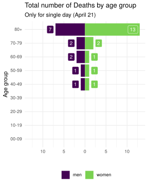
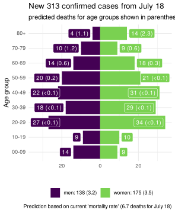
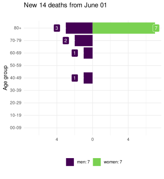

COVID-19 Portugal data
================

> R package with latest data scrapped from official sources

It downloads the [daily
report](https://covid19.min-saude.pt/relatorio-de-situacao/) from DGS
and stores this in data-friendly format under `/data` directory.

A more detailed analysis of this data is [available
here](https://averissimo.github.io/covid19-analysis/portugal.html)

# Check for new reports

``` r
download.updated.pt()
```

## Data for Portugal

<!-- -->

<!-- -->

# New cases / deaths by age groups

Only showing 1 day *(April
17)*

<!-- --><!-- -->

# Cases / Deaths by age groups

<!-- --><!-- -->

# Data

## Data from DGS

Only showing last 10
days

| country  | date       | confirmed | deaths | recovered |  tests | hospitalized | in.icu | confirmed\_m\_00-09 | confirmed\_w\_00-09 | confirmed\_m\_10-19 | confirmed\_w\_10-19 | confirmed\_m\_20-29 | confirmed\_w\_20-29 | confirmed\_m\_30-39 | confirmed\_w\_30-39 | confirmed\_m\_40-49 | confirmed\_w\_40-49 | confirmed\_m\_50-59 | confirmed\_w\_50-59 | confirmed\_m\_60-69 | confirmed\_w\_60-69 | confirmed\_m\_70-79 | confirmed\_w\_70-79 | confirmed\_m\_80+ | confirmed\_w\_80+ | death\_m\_00-09 | death\_w\_00-09 | death\_m\_10-19 | death\_w\_10-19 | death\_m\_20-29 | death\_w\_20-29 | death\_m\_30-39 | death\_w\_30-39 | death\_m\_40-49 | death\_w\_40-49 | death\_m\_50-59 | death\_w\_50-59 | death\_m\_60-69 | death\_w\_60-69 | death\_m\_70-79 | death\_w\_70-79 | death\_m\_80+ | death\_w\_80+ |
| :------- | :--------- | --------: | -----: | --------: | -----: | -----------: | -----: | ------------------: | ------------------: | ------------------: | ------------------: | ------------------: | ------------------: | ------------------: | ------------------: | ------------------: | ------------------: | ------------------: | ------------------: | ------------------: | ------------------: | ------------------: | ------------------: | ----------------: | ----------------: | --------------: | --------------: | --------------: | --------------: | --------------: | --------------: | --------------: | --------------: | --------------: | --------------: | --------------: | --------------: | --------------: | --------------: | --------------: | --------------: | ------------: | ------------: |
| Portugal | 2020-04-17 |     19022 |    657 |       519 | 158940 |         1284 |    222 |                 157 |                 165 |                 226 |                 261 |                 796 |                1217 |                1106 |                1543 |                1299 |                1997 |                1310 |                1996 |                1077 |                1264 |                 851 |                 880 |               960 |              1917 |               0 |               0 |               0 |               0 |               0 |               0 |               0 |               0 |               3 |               5 |              13 |               5 |              42 |              19 |              83 |              54 |           193 |           240 |
| Portugal | 2020-04-16 |     18841 |    629 |       493 | 154727 |         1302 |    229 |                 157 |                 164 |                 226 |                 259 |                 789 |                1205 |                1094 |                1530 |                1285 |                1982 |                1302 |                1977 |                1068 |                1251 |                 848 |                 867 |               950 |              1887 |               0 |               0 |               0 |               0 |               0 |               0 |               0 |               0 |               3 |               5 |              13 |               5 |              40 |              19 |              79 |              52 |           183 |           230 |
| Portugal | 2020-04-15 |     18091 |    599 |       383 | 150804 |         1200 |    208 |                 151 |                 153 |                 220 |                 250 |                 754 |                1144 |                1049 |                1457 |                1221 |                1903 |                1243 |                1890 |                1030 |                1212 |                 833 |                 840 |               920 |              1821 |               0 |               0 |               0 |               0 |               0 |               0 |               0 |               0 |               2 |               5 |              13 |               5 |              39 |              19 |              76 |              49 |           173 |           218 |
| Portugal | 2020-04-14 |     17448 |    567 |       347 | 142514 |         1227 |    218 |                 143 |                 147 |                 210 |                 241 |                 726 |                1094 |                1025 |                1397 |                1176 |                1829 |                1211 |                1817 |                 995 |                1173 |                 802 |                 824 |               884 |              1754 |               0 |               0 |               0 |               0 |               0 |               0 |               0 |               0 |               2 |               5 |              13 |               5 |              39 |              17 |              71 |              45 |           162 |           208 |
| Portugal | 2020-04-13 |     16934 |    535 |       277 | 139184 |         1187 |    188 |                 137 |                 147 |                 206 |                 229 |                 704 |                1059 |                1010 |                1362 |                1159 |                1773 |                1180 |                1762 |                 986 |                1120 |                 784 |                 781 |               859 |              1676 |               0 |               0 |               0 |               0 |               0 |               0 |               0 |               0 |               1 |               5 |              13 |               4 |              37 |              16 |              68 |              43 |           154 |           194 |
| Portugal | 2020-04-12 |     16585 |    504 |       277 | 136243 |         1177 |    228 |                 136 |                 147 |                 201 |                 229 |                 681 |                1030 |                 995 |                1329 |                1143 |                1752 |                1163 |                1728 |                 972 |                1101 |                 767 |                 750 |               845 |              1616 |               0 |               0 |               0 |               0 |               0 |               0 |               0 |               0 |               1 |               4 |              13 |               3 |              35 |              13 |              68 |              40 |           147 |           180 |
| Portugal | 2020-04-11 |     15987 |    470 |       266 | 130300 |         1175 |    233 |                 133 |                 132 |                 191 |                 224 |                 657 |                 982 |                 966 |                1290 |                1116 |                1701 |                1127 |                1665 |                 945 |                1065 |                 746 |                 714 |               816 |              1517 |               0 |               0 |               0 |               0 |               0 |               0 |               0 |               0 |               1 |               3 |              13 |               3 |              35 |              13 |              62 |              38 |           141 |           161 |
| Portugal | 2020-04-10 |     15472 |    435 |       233 | 123564 |         1179 |    226 |                 126 |                 119 |                 186 |                 214 |                 649 |                 959 |                 954 |                1261 |                1094 |                1641 |                1093 |                1619 |                 924 |                1035 |                 724 |                 682 |               777 |              1415 |               0 |               0 |               0 |               0 |               0 |               0 |               0 |               0 |               1 |               3 |              10 |               2 |              31 |              12 |              57 |              35 |           133 |           151 |
| Portugal | 2020-04-09 |     13956 |    409 |       205 | 115158 |         1173 |    241 |                 105 |                 101 |                 161 |                 190 |                 598 |                 846 |                 872 |                1141 |                1000 |                1483 |                1005 |                1452 |                 842 |                 938 |                 676 |                 608 |               703 |              1235 |               0 |               0 |               0 |               0 |               0 |               0 |               0 |               0 |               1 |               3 |               8 |               2 |              30 |              12 |              54 |              34 |           126 |           139 |
| Portugal | 2020-04-08 |     13141 |    380 |       196 | 104886 |         1211 |    245 |                  97 |                  95 |                 148 |                 175 |                 567 |                 796 |                 831 |                1093 |                 957 |                1423 |                 966 |                1386 |                 814 |                 896 |                 658 |                 568 |               619 |              1052 |               0 |               0 |               0 |               0 |               0 |               0 |               0 |               0 |               1 |               3 |               8 |               2 |              26 |              12 |              53 |              34 |           116 |           125 |

## Data from EU CDC updated

Only showing last 10
days

| dateRep    | day | month | year | cases | deaths | countriesAndTerritories | geoId | countryterritoryCode | popData2018 |
| :--------- | --: | ----: | ---: | ----: | -----: | :---------------------- | :---- | :------------------- | ----------: |
| 18/04/2020 |  18 |     4 | 2020 |   181 |     28 | Portugal                | PT    | PRT                  |    10281762 |
| 17/04/2020 |  17 |     4 | 2020 |   750 |     30 | Portugal                | PT    | PRT                  |    10281762 |
| 16/04/2020 |  16 |     4 | 2020 |   643 |     32 | Portugal                | PT    | PRT                  |    10281762 |
| 15/04/2020 |  15 |     4 | 2020 |   514 |     32 | Portugal                | PT    | PRT                  |    10281762 |
| 14/04/2020 |  14 |     4 | 2020 |   349 |     31 | Portugal                | PT    | PRT                  |    10281762 |
| 13/04/2020 |  13 |     4 | 2020 |   598 |     34 | Portugal                | PT    | PRT                  |    10281762 |
| 12/04/2020 |  12 |     4 | 2020 |   515 |     35 | Portugal                | PT    | PRT                  |    10281762 |
| 11/04/2020 |  11 |     4 | 2020 |  1516 |     26 | Portugal                | PT    | PRT                  |    10281762 |
| 10/04/2020 |  10 |     4 | 2020 |   815 |     29 | Portugal                | PT    | PRT                  |    10281762 |
| 09/04/2020 |   9 |     4 | 2020 |   699 |     35 | Portugal                | PT    | PRT                  |    10281762 |
