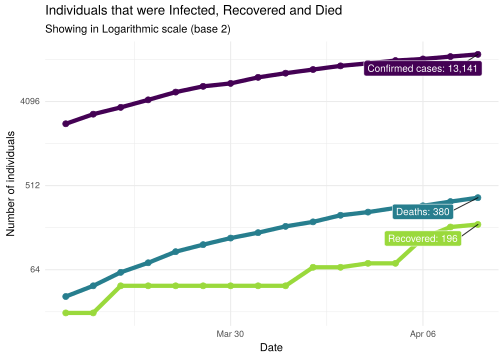

COVID-19 Portugal data
================

> R package with latest data scrapped from official sources

It downloads the [daily
report](https://covid19.min-saude.pt/relatorio-de-situacao/) from DGS
and stores this in data-friendly format under `/data` directory.

## Check for new reports

``` r
dat <- download.updated.pt()

dgs.pt.new     <- dat$dgs.pt 
covid19.pt.new <- dat$cdc.eu
```

## Stores in the package

``` r
dgs.pt <- tibble()
tryCatch(dgs.pt <- covid19.pt.data::dgs.pt, error = function(err) { })

# DGS PT
if (nrow(dgs.pt.new) != nrow(dgs.pt)) {
  dgs.pt <- dgs.pt.new 
  usethis::use_data(dgs.pt, overwrite = TRUE)
  readr::write_csv(dgs.pt, path = '../data/dgs_pt.csv')
}

# EU CDC
covid19.pt <- tibble()
tryCatch(covid19.pt <- covid19.pt.data::covid19.pt, error = function(err) { })

if (nrow(covid19.pt.new) != nrow(covid19.pt)) {
  covid19.pt <- covid19.pt.new
  usethis::use_data(covid19.pt, overwrite = TRUE)
  readr::write_csv(covid19.pt, path = '../data/covid19_pt.csv')
}
```

## Data for Portugal

    #> Warning: Removed 2 row(s) containing missing values (geom_path).
    #> Warning: Removed 2 rows containing missing values (geom_point).

<!-- -->

## Data from DGS

Only showing last 10
days

| country  | date       | confirmed | deaths | recovered |  tests | hospitalized | in.icu | confirmed\_m\_00-09 | confirmed\_w\_00-09 | confirmed\_m\_10-19 | confirmed\_w\_10-19 | confirmed\_m\_20-29 | confirmed\_w\_20-29 | confirmed\_m\_30-39 | confirmed\_w\_30-39 | confirmed\_m\_40-49 | confirmed\_w\_40-49 | confirmed\_m\_50-59 | confirmed\_w\_50-59 | confirmed\_m\_60-69 | confirmed\_w\_60-69 | confirmed\_m\_70-79 | confirmed\_w\_70-79 | confirmed\_m\_80+ | confirmed\_w\_80+ | death\_m\_00-09 | death\_w\_00-09 | death\_m\_10-19 | death\_w\_10-19 | death\_m\_20-29 | death\_w\_20-29 | death\_m\_30-39 | death\_w\_30-39 | death\_m\_40-49 | death\_w\_40-49 | death\_m\_50-59 | death\_w\_50-59 | death\_m\_60-69 | death\_w\_60-69 | death\_m\_70-79 | death\_w\_70-79 | death\_m\_80+ | death\_w\_80+ |
| :------- | :--------- | --------: | -----: | --------: | -----: | -----------: | -----: | ------------------: | ------------------: | ------------------: | ------------------: | ------------------: | ------------------: | ------------------: | ------------------: | ------------------: | ------------------: | ------------------: | ------------------: | ------------------: | ------------------: | ------------------: | ------------------: | ----------------: | ----------------: | --------------: | --------------: | --------------: | --------------: | --------------: | --------------: | --------------: | --------------: | --------------: | --------------: | --------------: | --------------: | --------------: | --------------: | --------------: | --------------: | ------------: | ------------: |
| Portugal | 2020-04-10 |     15472 |    435 |       233 | 123564 |         1179 |    226 |                 126 |                 119 |                 186 |                 214 |                 649 |                 959 |                 954 |                1261 |                1094 |                1641 |                1093 |                1619 |                 924 |                1035 |                 724 |                 682 |               777 |              1415 |               0 |               0 |               0 |               0 |               0 |               0 |               0 |               0 |               1 |               3 |              10 |               2 |              31 |              12 |              57 |              35 |           133 |           151 |
| Portugal | 2020-04-09 |     13956 |    409 |       205 | 115158 |         1173 |    241 |                 105 |                 101 |                 161 |                 190 |                 598 |                 846 |                 872 |                1141 |                1000 |                1483 |                1005 |                1452 |                 842 |                 938 |                 676 |                 608 |               703 |              1235 |               0 |               0 |               0 |               0 |               0 |               0 |               0 |               0 |               1 |               3 |               8 |               2 |              30 |              12 |              54 |              34 |           126 |           139 |
| Portugal | 2020-04-08 |     13141 |    380 |       196 | 104886 |         1211 |    245 |                  97 |                  95 |                 148 |                 175 |                 567 |                 796 |                 831 |                1093 |                 957 |                1423 |                 966 |                1386 |                 814 |                 896 |                 658 |                 568 |               619 |              1052 |               0 |               0 |               0 |               0 |               0 |               0 |               0 |               0 |               1 |               3 |               8 |               2 |              26 |              12 |              53 |              34 |           116 |           125 |
| Portugal | 2020-04-07 |     12442 |    345 |       184 |  99730 |         1180 |    271 |                  92 |                  87 |                 140 |                 166 |                 538 |                 756 |                 797 |                1021 |                 901 |                1338 |                 920 |                1296 |                 769 |                 845 |                 629 |                 530 |               605 |              1012 |               0 |               0 |               0 |               0 |               0 |               0 |               0 |               0 |               1 |               3 |               7 |               2 |              25 |              10 |              50 |              28 |           105 |           114 |
| Portugal | 2020-04-06 |     11730 |    311 |       140 |  91794 |         1099 |    270 |                  87 |                  87 |                 130 |                 155 |                 507 |                 708 |                 768 |                 963 |                 860 |                1269 |                 883 |                1217 |                 733 |                 802 |                 599 |                 503 |               562 |               897 |               0 |               0 |               0 |               0 |               0 |               0 |               0 |               0 |               1 |               3 |               6 |               2 |              22 |               7 |              45 |              26 |           100 |            99 |
| Portugal | 2020-04-05 |     11278 |    295 |        75 |  86370 |         1084 |    267 |                  81 |                  81 |                 123 |                 153 |                 487 |                 692 |                 738 |                 933 |                 826 |                1232 |                 863 |                1170 |                 714 |                 777 |                 580 |                 479 |               532 |               817 |               0 |               0 |               0 |               0 |               0 |               0 |               0 |               0 |               1 |               3 |               6 |               2 |              21 |               6 |              42 |              24 |            98 |            92 |
| Portugal | 2020-04-04 |     10524 |    266 |        75 |  81087 |         1075 |    251 |                  76 |                  74 |                 115 |                 137 |                 450 |                 632 |                 690 |                 877 |                 771 |                1157 |                 813 |                1095 |                 673 |                 723 |                 549 |                 450 |               495 |               747 |               0 |               0 |               0 |               0 |               0 |               0 |               0 |               0 |               1 |               3 |               6 |               2 |              20 |               4 |              38 |              22 |            84 |            86 |
| Portugal | 2020-04-03 |      9886 |    246 |        68 |  74377 |         1058 |    245 |                  68 |                  65 |                 104 |                 132 |                 425 |                 580 |                 648 |                 825 |                 734 |                1093 |                 761 |                1025 |                 646 |                 679 |                 525 |                 420 |               466 |               690 |               0 |               0 |               0 |               0 |               0 |               0 |               0 |               0 |               0 |               2 |               7 |               2 |              18 |               3 |              35 |              23 |            83 |            73 |
| Portugal | 2020-04-02 |      9034 |    209 |        68 |  66895 |         1042 |    240 |                  52 |                  63 |                  97 |                 122 |                 390 |                 506 |                 593 |                 735 |                 681 |                 970 |                 701 |                 929 |                 605 |                 622 |                 490 |                 402 |               435 |               641 |               0 |               0 |               0 |               0 |               0 |               0 |               0 |               0 |               0 |               2 |               6 |               2 |              16 |               2 |              30 |              15 |            73 |            63 |
| Portugal | 2020-04-01 |      8251 |    187 |        43 |  59457 |          726 |    230 |                  49 |                  55 |                  89 |                 116 |                 355 |                 470 |                 543 |                 677 |                 641 |                 879 |                 636 |                 840 |                 564 |                 569 |                 455 |                 378 |               381 |               554 |               0 |               0 |               0 |               0 |               0 |               0 |               0 |               0 |               0 |               2 |               6 |               1 |              16 |               1 |              27 |              14 |            62 |            58 |

## Data from EU CDC updated

Only showing last 10
days

| dateRep    | day | month | year | cases | deaths | countriesAndTerritories | geoId | countryterritoryCode | popData2018 |
| :--------- | --: | ----: | ---: | ----: | -----: | :---------------------- | :---- | :------------------- | ----------: |
| 11/04/2020 |  11 |     4 | 2020 |  1516 |     26 | Portugal                | PT    | PRT                  |    10281762 |
| 10/04/2020 |  10 |     4 | 2020 |   815 |     29 | Portugal                | PT    | PRT                  |    10281762 |
| 09/04/2020 |   9 |     4 | 2020 |   699 |     35 | Portugal                | PT    | PRT                  |    10281762 |
| 08/04/2020 |   8 |     4 | 2020 |   712 |     34 | Portugal                | PT    | PRT                  |    10281762 |
| 07/04/2020 |   7 |     4 | 2020 |   452 |     16 | Portugal                | PT    | PRT                  |    10281762 |
| 06/04/2020 |   6 |     4 | 2020 |   754 |     29 | Portugal                | PT    | PRT                  |    10281762 |
| 05/04/2020 |   5 |     4 | 2020 |   638 |     20 | Portugal                | PT    | PRT                  |    10281762 |
| 04/04/2020 |   4 |     4 | 2020 |   852 |     37 | Portugal                | PT    | PRT                  |    10281762 |
| 03/04/2020 |   3 |     4 | 2020 |   783 |     22 | Portugal                | PT    | PRT                  |    10281762 |
| 02/04/2020 |   2 |     4 | 2020 |   808 |     27 | Portugal                | PT    | PRT                  |    10281762 |
