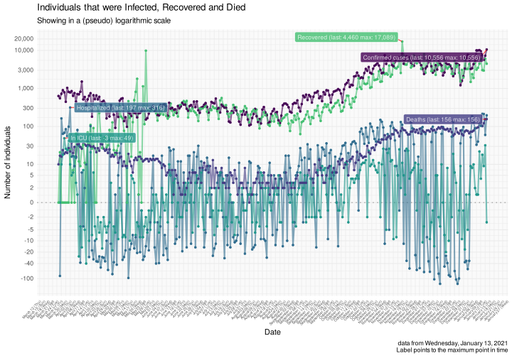

COVID-19 Portugal data
================

> R package with latest data scrapped from official sources *(last data
> from Wednesday, April 22, 2020)*

It downloads the [daily
report](https://covid19.min-saude.pt/relatorio-de-situacao/) from DGS
and stores this in data-friendly format under `/data` directory.

If you are here just for the data, this is what you want:
[dgs\_pt.csv](raw/master/data/dgs_pt.csv) or
[covid19\_pt.csv](raw/master/data/covid19_pt.csv) *(this dataset is an
updated EU CDC data with Portugal only)*

A more detailed analysis of this data is [available
here](https://averissimo.github.io/covid19-analysis/portugal.html)

# Check for new reports

``` r
download.updated.pt()
```

## Data for Portugal

<!-- -->

<!-- -->

# New cases / deaths by age groups

Only showing 1 day *(April
22)*

<!-- --><!-- -->

# Cases / Deaths by age groups

<!-- --><!-- -->

# Data

## Data from DGS

Only showing last 10
days

| country  | date       | confirmed | deaths | recovered |  tests | hospitalized | in.icu | confirmed\_m\_00-09 | confirmed\_w\_00-09 | confirmed\_m\_10-19 | confirmed\_w\_10-19 | confirmed\_m\_20-29 | confirmed\_w\_20-29 | confirmed\_m\_30-39 | confirmed\_w\_30-39 | confirmed\_m\_40-49 | confirmed\_w\_40-49 | confirmed\_m\_50-59 | confirmed\_w\_50-59 | confirmed\_m\_60-69 | confirmed\_w\_60-69 | confirmed\_m\_70-79 | confirmed\_w\_70-79 | confirmed\_m\_80+ | confirmed\_w\_80+ | death\_m\_00-09 | death\_w\_00-09 | death\_m\_10-19 | death\_w\_10-19 | death\_m\_20-29 | death\_w\_20-29 | death\_m\_30-39 | death\_w\_30-39 | death\_m\_40-49 | death\_w\_40-49 | death\_m\_50-59 | death\_w\_50-59 | death\_m\_60-69 | death\_w\_60-69 | death\_m\_70-79 | death\_w\_70-79 | death\_m\_80+ | death\_w\_80+ |
| :------- | :--------- | --------: | -----: | --------: | -----: | -----------: | -----: | ------------------: | ------------------: | ------------------: | ------------------: | ------------------: | ------------------: | ------------------: | ------------------: | ------------------: | ------------------: | ------------------: | ------------------: | ------------------: | ------------------: | ------------------: | ------------------: | ----------------: | ----------------: | --------------: | --------------: | --------------: | --------------: | --------------: | --------------: | --------------: | --------------: | --------------: | --------------: | --------------: | --------------: | --------------: | --------------: | --------------: | --------------: | ------------: | ------------: |
| Portugal | 2020-04-22 |     21982 |    785 |      1143 | 210302 |         1146 |    207 |                 171 |                 189 |                 295 |                 353 |                1022 |                1437 |                1296 |                1777 |                1439 |                2302 |                1466 |                2303 |                1220 |                1401 |                 936 |                1025 |              1108 |              2242 |               0 |               0 |               0 |               0 |               0 |               0 |               0 |               0 |               4 |               5 |              15 |               5 |              45 |              22 |              93 |              68 |           233 |           295 |
| Portugal | 2020-04-21 |     21379 |    762 |       917 | 202769 |         1172 |    213 |                 170 |                 189 |                 266 |                 321 |                 988 |                1390 |                1271 |                1713 |                1418 |                2202 |                1439 |                2231 |                1173 |                1384 |                 927 |                 978 |              1097 |              2222 |               0 |               0 |               0 |               0 |               0 |               0 |               0 |               0 |               4 |               5 |              15 |               5 |              45 |              22 |              91 |              68 |           225 |           282 |
| Portugal | 2020-04-20 |     20863 |    735 |       610 | 198353 |         1208 |    215 |                 170 |                 189 |                 262 |                 319 |                 933 |                1367 |                1237 |                1694 |                1417 |                2181 |                1391 |                2191 |                1171 |                1332 |                 905 |                 972 |              1041 |              2091 |               0 |               0 |               0 |               0 |               0 |               0 |               0 |               0 |               3 |               5 |              15 |               5 |              43 |              22 |              89 |              66 |           218 |           269 |
| Portugal | 2020-04-19 |     20206 |    714 |       610 | 187604 |         1243 |    224 |                 164 |                 181 |                 246 |                 290 |                 856 |                1293 |                1181 |                1650 |                1361 |                2112 |                1377 |                2133 |                1123 |                1321 |                 891 |                 935 |              1030 |              2062 |               0 |               0 |               0 |               0 |               0 |               0 |               0 |               0 |               3 |               5 |              15 |               5 |              43 |              22 |              88 |              63 |           209 |           261 |
| Portugal | 2020-04-18 |     19685 |    687 |       610 | 162711 |         1253 |    228 |                 157 |                 171 |                 231 |                 277 |                 828 |                1269 |                1150 |                1601 |                1332 |                2056 |                1349 |                2073 |                1107 |                1300 |                 876 |                 909 |              1000 |              1999 |               0 |               0 |               0 |               0 |               0 |               0 |               0 |               0 |               3 |               5 |              14 |               5 |              43 |              21 |              87 |              58 |           201 |           250 |
| Portugal | 2020-04-17 |     19022 |    657 |       519 | 158940 |         1284 |    222 |                 157 |                 165 |                 226 |                 261 |                 796 |                1217 |                1106 |                1543 |                1299 |                1997 |                1310 |                1996 |                1077 |                1264 |                 851 |                 880 |               960 |              1917 |               0 |               0 |               0 |               0 |               0 |               0 |               0 |               0 |               3 |               5 |              13 |               5 |              42 |              19 |              83 |              54 |           193 |           240 |
| Portugal | 2020-04-16 |     18841 |    629 |       493 | 154727 |         1302 |    229 |                 157 |                 164 |                 226 |                 259 |                 789 |                1205 |                1094 |                1530 |                1285 |                1982 |                1302 |                1977 |                1068 |                1251 |                 848 |                 867 |               950 |              1887 |               0 |               0 |               0 |               0 |               0 |               0 |               0 |               0 |               3 |               5 |              13 |               5 |              40 |              19 |              79 |              52 |           183 |           230 |
| Portugal | 2020-04-15 |     18091 |    599 |       383 | 150804 |         1200 |    208 |                 151 |                 153 |                 220 |                 250 |                 754 |                1144 |                1049 |                1457 |                1221 |                1903 |                1243 |                1890 |                1030 |                1212 |                 833 |                 840 |               920 |              1821 |               0 |               0 |               0 |               0 |               0 |               0 |               0 |               0 |               2 |               5 |              13 |               5 |              39 |              19 |              76 |              49 |           173 |           218 |
| Portugal | 2020-04-14 |     17448 |    567 |       347 | 142514 |         1227 |    218 |                 143 |                 147 |                 210 |                 241 |                 726 |                1094 |                1025 |                1397 |                1176 |                1829 |                1211 |                1817 |                 995 |                1173 |                 802 |                 824 |               884 |              1754 |               0 |               0 |               0 |               0 |               0 |               0 |               0 |               0 |               2 |               5 |              13 |               5 |              39 |              17 |              71 |              45 |           162 |           208 |
| Portugal | 2020-04-13 |     16934 |    535 |       277 | 139184 |         1187 |    188 |                 137 |                 147 |                 206 |                 229 |                 704 |                1059 |                1010 |                1362 |                1159 |                1773 |                1180 |                1762 |                 986 |                1120 |                 784 |                 781 |               859 |              1676 |               0 |               0 |               0 |               0 |               0 |               0 |               0 |               0 |               1 |               5 |              13 |               4 |              37 |              16 |              68 |              43 |           154 |           194 |

## Data from EU CDC updated

Only showing last 10 days.

Don’t be alarmed with the first line being in the future, EU CDC date
always refer to the situation on the previous
day.

| dateRep    | day | month | year | cases | deaths | countriesAndTerritories | geoId | countryterritoryCode | popData2018 | continentExp |
| :--------- | --: | ----: | ---: | ----: | -----: | :---------------------- | :---- | :------------------- | ----------: | :----------- |
| 23/04/2020 |  23 |     4 | 2020 |   603 |     23 | Portugal                | PT    | PRT                  |    10281762 | NA           |
| 22/04/2020 |  22 |     4 | 2020 |   516 |     27 | Portugal                | PT    | PRT                  |    10281762 | Europe       |
| 21/04/2020 |  21 |     4 | 2020 |   657 |     21 | Portugal                | PT    | PRT                  |    10281762 | Europe       |
| 20/04/2020 |  20 |     4 | 2020 |   521 |     27 | Portugal                | PT    | PRT                  |    10281762 | Europe       |
| 19/04/2020 |  19 |     4 | 2020 |   663 |     30 | Portugal                | PT    | PRT                  |    10281762 | Europe       |
| 18/04/2020 |  18 |     4 | 2020 |   181 |     28 | Portugal                | PT    | PRT                  |    10281762 | Europe       |
| 17/04/2020 |  17 |     4 | 2020 |   750 |     30 | Portugal                | PT    | PRT                  |    10281762 | Europe       |
| 16/04/2020 |  16 |     4 | 2020 |   643 |     32 | Portugal                | PT    | PRT                  |    10281762 | Europe       |
| 15/04/2020 |  15 |     4 | 2020 |   514 |     32 | Portugal                | PT    | PRT                  |    10281762 | Europe       |
| 14/04/2020 |  14 |     4 | 2020 |   349 |     31 | Portugal                | PT    | PRT                  |    10281762 | Europe       |
