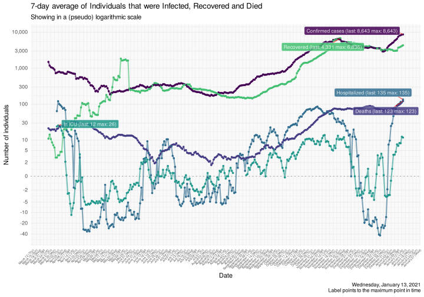

COVID-19 Portugal data
================

> R package with latest data scrapped from official sources *(last data
> from Tuesday, July 07, 2020)*

It downloads the [daily
report](https://covid19.min-saude.pt/relatorio-de-situacao/) from DGS
and stores this in data-friendly format under `/data` directory.

If you are here just for the data, this is what you want:

  - [dgs\_pt.csv](raw/master/data/dgs_pt.csv) *(raw data from Portugal’s
    DGS)*
  - [covid19\_pt.csv](raw/master/data/covid19_pt.csv) *(updated EU CDC
    dataset only featuring Portugal)*

A more detailed analysis of this data is [available
here](https://averissimo.github.io/covid19-analysis/portugal.html)

# Check for new reports

``` r
download.updated.pt()
```

## Data for Portugal

<!-- -->

<!-- -->

# New cases / deaths by age groups

Only showing 1 day *(July
07)*

<!-- --><!-- -->

# Cases / Deaths by age groups

<!-- --><!-- -->

# Data

## Data from DGS

Only showing last 10
days

| country  | date       | confirmed | deaths | recovered | tests | hospitalized | in.icu | confirmed\_m\_00-09 | confirmed\_w\_00-09 | confirmed\_m\_10-19 | confirmed\_w\_10-19 | confirmed\_m\_20-29 | confirmed\_w\_20-29 | confirmed\_m\_30-39 | confirmed\_w\_30-39 | confirmed\_m\_40-49 | confirmed\_w\_40-49 | confirmed\_m\_50-59 | confirmed\_w\_50-59 | confirmed\_m\_60-69 | confirmed\_w\_60-69 | confirmed\_m\_70-79 | confirmed\_w\_70-79 | confirmed\_m\_80+ | confirmed\_w\_80+ | death\_m\_00-09 | death\_w\_00-09 | death\_m\_10-19 | death\_w\_10-19 | death\_m\_20-29 | death\_w\_20-29 | death\_m\_30-39 | death\_w\_30-39 | death\_m\_40-49 | death\_w\_40-49 | death\_m\_50-59 | death\_w\_50-59 | death\_m\_60-69 | death\_w\_60-69 | death\_m\_70-79 | death\_w\_70-79 | death\_m\_80+ | death\_w\_80+ |
| :------- | :--------- | --------: | -----: | --------: | ----: | -----------: | -----: | ------------------: | ------------------: | ------------------: | ------------------: | ------------------: | ------------------: | ------------------: | ------------------: | ------------------: | ------------------: | ------------------: | ------------------: | ------------------: | ------------------: | ------------------: | ------------------: | ----------------: | ----------------: | --------------: | --------------: | --------------: | --------------: | --------------: | --------------: | --------------: | --------------: | --------------: | --------------: | --------------: | --------------: | --------------: | --------------: | --------------: | --------------: | ------------: | ------------: |
| Portugal | 2020-07-07 |     34693 |   1479 |     20995 |    NA |          398 |     58 |                 412 |                 379 |                 546 |                 661 |                2181 |                2568 |                2445 |                2916 |                2497 |                3340 |                2313 |                3343 |                1730 |                1977 |                1272 |                1429 |              1517 |              3134 |               0 |               0 |               0 |               0 |               1 |               1 |               0 |               1 |              10 |               7 |              32 |              15 |              87 |              43 |             170 |             112 |           430 |           570 |
| Portugal | 2020-06-12 |     36180 |   1505 |     22200 |    NA |          440 |     73 |                 473 |                 424 |                 603 |                 711 |                2332 |                2698 |                2620 |                3037 |                2620 |                3438 |                2417 |                3456 |                1801 |                2052 |                1301 |                1450 |              1535 |              3187 |               0 |               0 |               0 |               0 |               1 |               1 |               0 |               1 |              10 |               7 |              33 |              15 |              90 |              43 |             173 |             115 |           439 |           577 |
| Portugal | 2020-06-11 |     35910 |   1504 |     22002 |    NA |          415 |     70 |                 459 |                 414 |                 592 |                 695 |                2305 |                2663 |                2596 |                3017 |                2605 |                3413 |                2399 |                3439 |                1792 |                2039 |                1293 |                1446 |              1535 |              3182 |               0 |               0 |               0 |               0 |               1 |               1 |               0 |               1 |              10 |               7 |              33 |              15 |              90 |              43 |             172 |             115 |           439 |           577 |
| Portugal | 2020-06-10 |     35600 |   1497 |     21742 |    NA |          417 |     70 |                 447 |                 403 |                 581 |                 681 |                2277 |                2650 |                2530 |                2983 |                2582 |                3400 |                2383 |                3412 |                1774 |                2028 |                1291 |                1443 |              1532 |              3178 |               0 |               0 |               0 |               0 |               1 |               1 |               0 |               1 |              10 |               7 |              33 |              15 |              88 |              43 |             171 |             114 |           437 |           576 |
| Portugal | 2020-06-09 |     35306 |   1492 |     21339 |    NA |          394 |     65 |                 436 |                 391 |                 562 |                 672 |                2244 |                2630 |                2502 |                2957 |                2559 |                3370 |                2367 |                3386 |                1760 |                2011 |                1284 |                1440 |              1531 |              3168 |               0 |               0 |               0 |               0 |               1 |               1 |               0 |               1 |              10 |               7 |              33 |              15 |              88 |              43 |             171 |             113 |           434 |           575 |
| Portugal | 2020-06-08 |     34885 |   1485 |     21156 |    NA |          366 |     55 |                 422 |                 386 |                 559 |                 666 |                2200 |                2590 |                2455 |                2925 |                2508 |                3352 |                2326 |                3361 |                1740 |                1989 |                1276 |                1432 |              1521 |              3144 |               0 |               0 |               0 |               0 |               1 |               1 |               0 |               1 |              10 |               7 |              32 |              15 |              88 |              43 |             171 |             112 |           434 |           570 |
| Portugal | 2020-06-07 |     34693 |   1479 |     20995 |    NA |          398 |     58 |                 412 |                 379 |                 546 |                 661 |                2181 |                2568 |                2445 |                2916 |                2497 |                3340 |                2313 |                3343 |                1730 |                1977 |                1272 |                1429 |              1517 |              3134 |               0 |               0 |               0 |               0 |               1 |               1 |               0 |               1 |              10 |               7 |              32 |              15 |              87 |              43 |             170 |             112 |           430 |           570 |
| Portugal | 2020-06-06 |     34351 |   1474 |     20807 |    NA |          414 |     57 |                 401 |                 371 |                 539 |                 652 |                2154 |                2538 |                2415 |                2894 |                2464 |                3312 |                2287 |                3323 |                1710 |                1963 |                1269 |                1420 |              1518 |              3121 |               0 |               0 |               0 |               0 |               1 |               1 |               0 |               1 |              10 |               7 |              31 |              15 |              87 |              43 |             170 |             112 |           427 |           569 |
| Portugal | 2020-06-05 |     33969 |   1465 |     20526 |    NA |          475 |     64 |                 393 |                 362 |                 533 |                 637 |                2113 |                2497 |                2366 |                2860 |                2422 |                3271 |                2265 |                3299 |                1705 |                1953 |                1261 |                1406 |              1509 |              3117 |               0 |               0 |               0 |               0 |               1 |               1 |               0 |               1 |              10 |               7 |              31 |              15 |              87 |              43 |             168 |             112 |           424 |           565 |
| Portugal | 2020-06-04 |     33592 |   1455 |     20323 |    NA |          445 |     58 |                 383 |                 355 |                 525 |                 626 |                2067 |                2463 |                2310 |                2820 |                2390 |                3248 |                2236 |                3273 |                1691 |                1932 |                1256 |                1398 |              1502 |              3117 |               0 |               0 |               0 |               0 |               1 |               1 |               0 |               1 |              10 |               7 |              31 |              15 |              86 |              43 |             168 |             111 |           422 |           559 |

## Data from EU CDC updated

Only showing last 10 days.

Don’t be alarmed with the first line being in the future, EU CDC date
always refer to the situation on the previous
day.

| dateRep    | day | month | year | cases | deaths | countriesAndTerritories | geoId | countryterritoryCode | popData2018 | continentExp |
| :--------- | --: | ----: | ---: | ----: | -----: | :---------------------- | :---- | :------------------- | ----------: | :----------- |
| 13/06/2020 |  13 |     6 | 2020 |   270 |      1 | Portugal                | PT    | PRT                  |    10281762 | NA           |
| 12/06/2020 |  12 |     6 | 2020 |   310 |      9 | Portugal                | PT    | PRT                  |    10281762 | Europe       |
| 11/06/2020 |  11 |     6 | 2020 |   294 |      3 | Portugal                | PT    | PRT                  |    10281762 | Europe       |
| 10/06/2020 |  10 |     6 | 2020 |   421 |      7 | Portugal                | PT    | PRT                  |    10281762 | Europe       |
| 09/06/2020 |   9 |     6 | 2020 |   392 |      6 | Portugal                | PT    | PRT                  |    10281762 | Europe       |
| 08/06/2020 |   8 |     6 | 2020 |   142 |      5 | Portugal                | PT    | PRT                  |    10281762 | Europe       |
| 07/06/2020 |   7 |     6 | 2020 |   382 |      9 | Portugal                | PT    | PRT                  |    10281762 | Europe       |
| 06/06/2020 |   6 |     6 | 2020 |   377 |     10 | Portugal                | PT    | PRT                  |    10281762 | Europe       |
| 05/06/2020 |   5 |     6 | 2020 |   331 |      8 | Portugal                | PT    | PRT                  |    10281762 | Europe       |
| 04/06/2020 |   4 |     6 | 2020 |   366 |     11 | Portugal                | PT    | PRT                  |    10281762 | Europe       |
