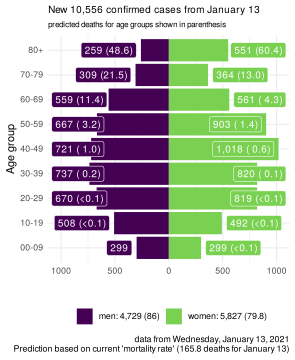

COVID-19 Portugal data
================

> R package with latest data scrapped from official sources *(last data
> from Saturday, December 05, 2020)*

It downloads the [daily
report](https://covid19.min-saude.pt/relatorio-de-situacao/) from DGS
and stores this in data-friendly format under `/data` directory.

If you are here just for the data, this is what you want:

  - [dgs\_pt.csv](raw/master/data/dgs_pt.csv) *(raw data from Portugal’s
    DGS)*
  - [covid19\_pt.csv](raw/master/data/covid19_pt.csv) *(updated EU CDC
    dataset only featuring Portugal)*

A mortality analysis of Portugal is [available
here](https://averissimo.github.io/covid19-analysis/mortality.html)

# Check for new reports

``` r
download.updated.pt()
```

## Data for Portugal

<!-- -->

<!-- -->

<!-- -->

# New cases / deaths by age groups

*note: data update may be delayed by a couple of hours (since age data
was been removed from daily report and we’ve been retrieving it from
DGS’s covid19 dashboard, which may have a delay)*

Age data may show different numbers from absolutes in the daily report.
This is out of our control and dependent on the data source *(DGS
covid19 dashboard)*.

<!-- --><!-- -->

# All cases / deaths by age groups

Age data may show different numbers from absolutes in the daily report.
This is out of our control and dependent on the data source *(DGS
covid19 dashboard)*.

<!-- --><!-- -->

# Data

## Data from DGS

Only showing last 10 days

| country  | date       | confirmed | deaths | recovered | tests | hospitalized | in.icu | confirmed\_m\_00-09 | confirmed\_w\_00-09 | confirmed\_m\_10-19 | confirmed\_w\_10-19 | confirmed\_m\_20-29 | confirmed\_w\_20-29 | confirmed\_m\_30-39 | confirmed\_w\_30-39 | confirmed\_m\_40-49 | confirmed\_w\_40-49 | confirmed\_m\_50-59 | confirmed\_w\_50-59 | confirmed\_m\_60-69 | confirmed\_w\_60-69 | confirmed\_m\_70-79 | confirmed\_w\_70-79 | confirmed\_m\_80+ | confirmed\_w\_80+ | death\_m\_00-09 | death\_w\_00-09 | death\_m\_10-19 | death\_w\_10-19 | death\_m\_20-29 | death\_w\_20-29 | death\_m\_30-39 | death\_w\_30-39 | death\_m\_40-49 | death\_w\_40-49 | death\_m\_50-59 | death\_w\_50-59 | death\_m\_60-69 | death\_w\_60-69 | death\_m\_70-79 | death\_w\_70-79 | death\_m\_80+ | death\_w\_80+ |
| :------- | :--------- | --------: | -----: | --------: | ----: | -----------: | -----: | ------------------: | ------------------: | ------------------: | ------------------: | ------------------: | ------------------: | ------------------: | ------------------: | ------------------: | ------------------: | ------------------: | ------------------: | ------------------: | ------------------: | ------------------: | ------------------: | ----------------: | ----------------: | --------------: | --------------: | --------------: | --------------: | --------------: | --------------: | --------------: | --------------: | --------------: | --------------: | --------------: | --------------: | --------------: | --------------: | --------------: | --------------: | ------------: | ------------: |
| Portugal | 2020-12-05 |    318640 |   4876 |    240203 |    NA |         3229 |    517 |                  NA |                  NA |                  NA |                  NA |                  NA |                  NA |                  NA |                  NA |                  NA |                  NA |                  NA |                  NA |                  NA |                  NA |                  NA |                  NA |                NA |                NA |              NA |              NA |              NA |              NA |              NA |              NA |              NA |              NA |              NA |              NA |              NA |              NA |              NA |              NA |              NA |              NA |            NA |            NA |
| Portugal | 2020-12-04 |    312553 |   4803 |    234038 |    NA |         3295 |    526 |                8161 |                7735 |               13632 |               14055 |               22093 |               25601 |               21066 |               25585 |               22346 |               29355 |               19637 |               25728 |               14195 |               15461 |                8956 |               10088 |              7731 |             15851 |               0 |               1 |               0 |               0 |               2 |               3 |               4 |               4 |              30 |              15 |             102 |              37 |             286 |             114 |             607 |             377 |          1471 |          1750 |
| Portugal | 2020-12-03 |    307618 |   4724 |    229018 |    NA |         3330 |    525 |                8022 |                7574 |               13394 |               13784 |               21777 |               25276 |               20754 |               25184 |               21986 |               28846 |               19325 |               25336 |               13891 |               15220 |                8826 |                9907 |              7610 |             15580 |               0 |               1 |               0 |               0 |               2 |               3 |               4 |               4 |              30 |              15 |             101 |              37 |             283 |             113 |             601 |             368 |          1441 |          1721 |
| Portugal | 2020-12-02 |    303846 |   4645 |    223446 |    NA |         3338 |    525 |                7915 |                7475 |               13243 |               13603 |               21554 |               25000 |               20512 |               24920 |               21729 |               28484 |               19100 |               25003 |               13797 |               15029 |                8692 |                9757 |              7500 |             15330 |               0 |               1 |               0 |               0 |               2 |               3 |               4 |               4 |              30 |              15 |              98 |              37 |             277 |             112 |             590 |             362 |          1419 |          1691 |
| Portugal | 2020-12-01 |    300462 |   4577 |    220877 |    NA |         3275 |    521 |                7791 |                7371 |               13084 |               13418 |               21363 |               24727 |               20315 |               24644 |               21468 |               28122 |               18902 |               24719 |               13648 |               14876 |                8599 |                9659 |              7411 |             15164 |               0 |               1 |               0 |               0 |               2 |               3 |               4 |               4 |              28 |              15 |              98 |              37 |             273 |             112 |             574 |             360 |          1400 |          1666 |
| Portugal | 2020-11-30 |    298061 |   4505 |    212942 |    NA |         3342 |    525 |                7734 |                7309 |               12972 |               13286 |               21244 |               24573 |               20186 |               24456 |               21304 |               27900 |               18754 |               24506 |               13527 |               14729 |                8512 |                9569 |              7331 |             15010 |               0 |               1 |               0 |               0 |               2 |               2 |               4 |               3 |              27 |              15 |              97 |              37 |             269 |             111 |             565 |             354 |          1380 |          1638 |
| Portugal | 2020-11-29 |    294799 |   4427 |    209534 |    NA |         3245 |    536 |                7647 |                7180 |               12809 |               13111 |               21046 |               24352 |               20031 |               24209 |               21084 |               27596 |               18566 |               24255 |               13383 |               14549 |                8398 |                9444 |              7229 |             14792 |               0 |               1 |               0 |               0 |               2 |               2 |               3 |               3 |              27 |              15 |              95 |              36 |             261 |             110 |             555 |             345 |          1359 |          1613 |
| Portugal | 2020-11-28 |    290706 |   4363 |    206275 |    NA |         3155 |    529 |                7510 |                7031 |               12576 |               12914 |               20793 |               24037 |               19778 |               23892 |               20839 |               27197 |               18330 |               23905 |               13182 |               14347 |                8271 |                9283 |              7151 |             14579 |               0 |               1 |               0 |               0 |               2 |               2 |               3 |               3 |              26 |              15 |              92 |              36 |             258 |             108 |             549 |             340 |          1338 |          1590 |
| Portugal | 2020-11-27 |    285838 |   4276 |    199446 |    NA |         3208 |    526 |                7341 |                6885 |               12326 |               12670 |               20498 |               23682 |               19486 |               23520 |               20537 |               26733 |               18006 |               23453 |               12949 |               14091 |                8148 |                9126 |              6995 |             14261 |               0 |               1 |               0 |               0 |               2 |               2 |               3 |               3 |              24 |              15 |              90 |              35 |             250 |             106 |             533 |             332 |          1311 |          1569 |
| Portugal | 2020-11-26 |    280394 |   4209 |    193944 |    NA |         3192 |    516 |                6966 |                6518 |               11687 |               12046 |               19695 |               22829 |               18723 |               22619 |               19695 |               25599 |               17285 |               22548 |               12385 |               13464 |                7822 |                8737 |              6731 |             13725 |               0 |               1 |               0 |               0 |               2 |               2 |               3 |               3 |              23 |              14 |              88 |              34 |             244 |             104 |             510 |             315 |          1264 |          1520 |
| Portugal | 2020-11-25 |    274011 |   4127 |    189356 |    NA |         3251 |    517 |                6966 |                6518 |               11687 |               12406 |               19695 |               22829 |               18723 |               22619 |               19695 |               25599 |               17285 |               22548 |               12385 |               13464 |                7822 |                8737 |              6731 |             13725 |               0 |               1 |               0 |               0 |               2 |               2 |               3 |               3 |              23 |              14 |              88 |              34 |             244 |             104 |             510 |             315 |          1264 |          1520 |
| Portugal | 2020-11-24 |    268721 |   4056 |    184233 |    NA |         3275 |    506 |                6817 |                6362 |               11418 |               11791 |               19395 |               22441 |               18392 |               22230 |               19322 |               25085 |               16946 |               22073 |               12098 |               13188 |                7658 |                8552 |              6603 |             13469 |               0 |               1 |               0 |               0 |               2 |               2 |               3 |               3 |              23 |              14 |              85 |              34 |             239 |             102 |             499 |             308 |          1244 |          1497 |
| Portugal | 2020-11-23 |    264802 |   3971 |    176827 |    NA |         3241 |    498 |                6704 |                6227 |               11214 |               11623 |               19163 |                2988 |               18122 |               21900 |               19022 |               24693 |               16694 |               21739 |               11928 |               12988 |                7539 |                8417 |              6529 |             13298 |               0 |               1 |               0 |               0 |               2 |               2 |               3 |               3 |              23 |              14 |              84 |              34 |             231 |             100 |             491 |             304 |          1222 |          1457 |
| Portugal | 2020-11-22 |    260758 |   3897 |    172919 |    NA |         3151 |    491 |                6584 |                6110 |               11005 |               11408 |               18920 |               21845 |               17848 |               21589 |               18693 |               24344 |               16429 |               21410 |               11743 |               12785 |                7440 |                8290 |              6430 |             13104 |               0 |               1 |               0 |               0 |               2 |               2 |               3 |               3 |              23 |              14 |              81 |              33 |             228 |             100 |             477 |             297 |          1199 |          1434 |
| Portugal | 2020-11-21 |    255970 |   3824 |    169379 |    NA |         3025 |    485 |                  NA |                  NA |                  NA |                  NA |                  NA |                  NA |                  NA |                  NA |                  NA |                  NA |                  NA |                  NA |                  NA |                  NA |                  NA |                  NA |                NA |                NA |              NA |              NA |              NA |              NA |              NA |              NA |              NA |              NA |              NA |              NA |              NA |              NA |              NA |              NA |              NA |              NA |            NA |            NA |
| Portugal | 2020-11-20 |    249498 |   3762 |    163000 |    NA |         3079 |    481 |                6220 |                5723 |               10437 |               10825 |               18213 |               21022 |               17172 |               20736 |               17899 |               23293 |               15697 |               20419 |               11204 |               12186 |                7088 |                7923 |              6186 |             12563 |               0 |               1 |               0 |               0 |               2 |               1 |               3 |               3 |              23 |              13 |              80 |              32 |             218 |              97 |             462 |             286 |          1144 |          1397 |
| Portugal | 2020-11-19 |    243009 |   3701 |    157924 |    NA |         3017 |    458 |                  NA |                  NA |                  NA |                  NA |                  NA |                  NA |                  NA |                  NA |                  NA |                  NA |                  NA |                  NA |                  NA |                  NA |                  NA |                  NA |                NA |                NA |              NA |              NA |              NA |              NA |              NA |              NA |              NA |              NA |              NA |              NA |              NA |              NA |              NA |              NA |              NA |              NA |            NA |            NA |
| Portugal | 2020-11-18 |    236015 |   3632 |    153702 |    NA |         3051 |    432 |                  NA |                  NA |                  NA |                  NA |                  NA |                  NA |                  NA |                  NA |                  NA |                  NA |                  NA |                  NA |                  NA |                  NA |                  NA |                  NA |                NA |                NA |              NA |              NA |              NA |              NA |              NA |              NA |              NA |              NA |              NA |              NA |              NA |              NA |              NA |              NA |              NA |              NA |            NA |            NA |
| Portugal | 2020-11-17 |    230124 |   3553 |    149445 |    NA |         3028 |    431 |                  NA |                  NA |                  NA |                  NA |                  NA |                  NA |                  NA |                  NA |                  NA |                  NA |                  NA |                  NA |                  NA |                  NA |                  NA |                  NA |                NA |                NA |              NA |              NA |              NA |              NA |              NA |              NA |              NA |              NA |              NA |              NA |              NA |              NA |              NA |              NA |              NA |              NA |            NA |            NA |
| Portugal | 2020-11-16 |    225672 |   3472 |    142155 |    NA |         3040 |    426 |                  NA |                  NA |                  NA |                  NA |                  NA |                  NA |                  NA |                  NA |                  NA |                  NA |                  NA |                  NA |                  NA |                  NA |                  NA |                  NA |                NA |                NA |              NA |              NA |              NA |              NA |              NA |              NA |              NA |              NA |              NA |              NA |              NA |              NA |              NA |              NA |              NA |              NA |            NA |            NA |

## Data from EU CDC updated

Only showing last 10 days.

Don’t be alarmed with the first line being in the future, EU CDC date
always refer to the situation on the previous day.

| dateRep    | day | month | year | cases | deaths | countriesAndTerritories | geoId | countryterritoryCode | popData2019 | continentExp | Cumulative\_number\_for\_14\_days\_of\_COVID-19\_cases\_per\_100000 |
| :--------- | --: | ----: | ---: | ----: | -----: | :---------------------- | :---- | :------------------- | ----------: | :----------- | ------------------------------------------------------------------: |
| 06/12/2020 |   6 |    12 | 2020 |  6087 |     73 | Portugal                | PT    | PRT                  |    10276617 | Europe       |                                                                  NA |
| 05/12/2020 |   5 |    12 | 2020 |  4935 |     79 | Portugal                | PT    | PRT                  |    10276617 | Europe       |                                                            613.5774 |
| 04/12/2020 |   4 |    12 | 2020 |  3772 |     79 | Portugal                | PT    | PRT                  |    10276617 | Europe       |                                                            628.6991 |
| 03/12/2020 |   3 |    12 | 2020 |  3384 |     68 | Portugal                | PT    | PRT                  |    10276617 | Europe       |                                                            660.0518 |
| 02/12/2020 |   2 |    12 | 2020 |  2401 |     72 | Portugal                | PT    | PRT                  |    10276617 | Europe       |                                                            684.4470 |
| 01/12/2020 |   1 |    12 | 2020 |  3262 |     78 | Portugal                | PT    | PRT                  |    10276617 | Europe       |                                                            704.4050 |
| 30/11/2020 |  30 |    11 | 2020 |  4093 |     64 | Portugal                | PT    | PRT                  |    10276617 | Europe       |                                                            754.1198 |
| 29/11/2020 |  29 |    11 | 2020 |  4868 |     87 | Portugal                | PT    | PRT                  |    10276617 | Europe       |                                                            773.0170 |
| 28/11/2020 |  28 |    11 | 2020 |  5444 |     67 | Portugal                | PT    | PRT                  |    10276617 | Europe       |                                                            789.8903 |
| 27/11/2020 |  27 |    11 | 2020 |  6383 |     82 | Portugal                | PT    | PRT                  |    10276617 | Europe       |                                                            801.6549 |
